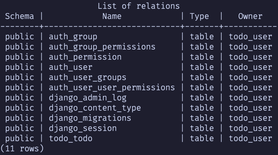
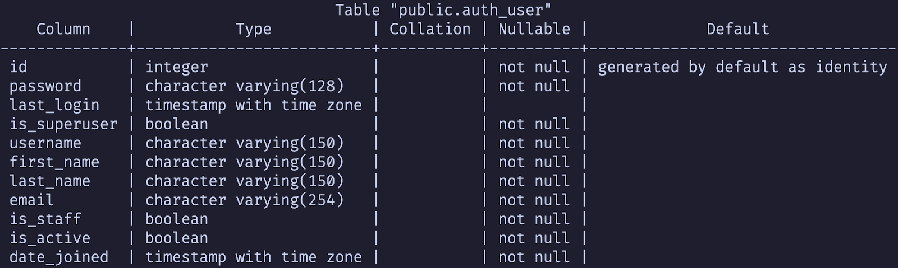
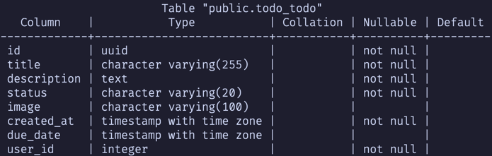

# [ASSIGNMENT] Individual Project

## **Jullaphong Jiamwatthanaloet 6510545314**

---

## 1) Framework:

**Selected Framework:** Django  
**Reasons:**

- Django is a framework that allows fast development of a simple web
  application.
- It includes built-in support for ORM (Object-Relational Mapping) and user
  authentication.
- This matches the requirements of this project, which requires authentication
  and storing data in the database.
- It supports storing image URLs as part of the model table, which also matches
  the optional requirement that a todo item contains the image.

---

## 2) Database:

### **Main Database**

**Type:** PostgreSQL (Docker Container)  
**Structure:**  
The application uses PostgreSQL as the primary database, running within a
Docker container for ease of deployment, scalability, and consistency across
environments. The database is responsible for managing both user authentication
data and todo-related data, ensuring data integrity, security, and efficient
access.



While Django auto-generates several tables by default, the key tables relevant
to this application are:

- **auth_user:** Automatically created by Django to manage user credentials and
  authentication. It stores essential user-related information such as
  usernames, passwords (securely hashed), email addresses, and timestamps like
  last login and account creation. The table also includes several boolean
  fields that control access, including is_active, is_staff, and is_superuser.
  These fields determine whether a user can log in, access the admin panel, or
  has full administrative permissions.
  

- **todo_todo:** Custom table created to store todo items. This table is
  designed to store details of a to-do task, including its title, detailed
  description, current status, and optional metadata such as an associated
  image and a due date. Each record is uniquely identified by a UUID and is
  linked to a specific user through the user_id foreign key.
  

In addition to the main PostgreSQL database, the application utilizes **object
storage** for managing media files including images associated with todo items.

### **Object Storage:**

**Type:** MinIO (Docker Container)  
**Structure:**  
Images uploaded by users are stored in the todo-media bucket. Django manages
these images through the ImageField in the todo_todo table, storing only the
reference (URL/path) to the image in the database, while the actual files
are stored in MinIO.

---

## 3) GitHub Repository:

[https://github.com/J-Jullaphong/getthingsdone](https://github.com/J-Jullaphong/getthingsdone)

---

## 4) Application Deployment:

### 1. Clone the repository from GitHub:

```bash
git clone https://github.com/J-Jullaphong/getthingsdone.git
cd getthingsdone
```

### 2. Create a .env file for externalized variables. (For simplicity in this project, you can just use default values in the sample.env):

- **Linux and macOS**
  ```bash
  cp sample.env .env
  ```
- **Windows**
  ```bash
  copy sample.env .env
  ```

### 3. Start the app:

```bash
docker compose up --build -d
```

### 4. Access the app via:

[http://localhost:8000](http://localhost:8000)

### 5. To stop the app:

```bash
docker compose down --volumes
```

---

## 5) Code Explanation:

The application follows `Django's Model-View-Template (MVT)` architecture,
which
is a variant of the `Layered Architecture Style`. This structure helps organize
the application into clearly defined layers: models for data, views for
business logic, and templates for presentation.

### 1. Models:

The model layer is designed to support all core features of the application,
including ownership, deadline tracking, status updates, and optional image
uploads.

**Todo:**  
This model represents each todo item. It includes:

- A UUID primary key for unique identification.
- A ForeignKey to the User model, ensuring that each todo is linked to the user
  who created it.
- Fields for title, description, and status, with status being a choice
  between "Pending", "In Progress", or "Done".
- An optional image field, allowing users to upload a picture associated with
  the todo. Uploaded images are stored using a custom file
  path (`todo_images/{uuid}.ext`).
- A created_at timestamp and an optional due_date.
- A `clean()` method that validates the due_date to ensure it isn't set in the
  past.
- An `is_overdue` property that checks whether the task is overdue and not
  marked as done.

### 2. Views:

Views are based on Django class-based views and use `LoginRequiredMixin` to
ensure only authenticated users can access them.

- **SignUpView:** Handles user registration using a custom user creation form.
- **LoginView:** Handles user login using a custom authentication form.
- **LogoutView:** Logs out the user and redirects to the login page.
- **TodoListView:** Displays the list of todo items belonging to the currently
  logged-in user.
- **TodoCreateView:** Allows the user to create a new todo item.
- **TodoDeleteView:** Allows deletion of a todo item.
- **TodoUpdateView:** Enables editing an existing todo item.

### 3. Templates:

Templates are built with Bootstrap 5 for responsive UI and follow a consistent
layout using `base.html`.

- **login.html, signup.html:** Handle user authentication (login and registration forms).
- **todo_list.html:** Displays the user's todo items in a structured, column-based layout.
- **partial/add_todo_modal.html:** A modal for adding new todo items via AJAX.
- **partial/update_todo_modal.html:** A modal for updating existing todo items with prefilled data.

### 4. Forms:

Forms are based on Django's form system and customized to provide a better user
experience using Bootstrap styling. They handle input validation, layout, and
integration with the database models.

- **CustomAuthenticationForm:** Extends Django’s login form with Bootstrap
  styling.
- **CustomUserCreationForm:** Used for user registration, also styled with
  Bootstrap.
- **TodoForm:** Handles user input for creating and updating todo items.
  Includes fields for the title, description, status, image, and due date.

### AJAX Functionality:

AJAX is used to make the application feel more dynamic and interactive without
requiring full page reloads.

- **Drag & Drop Status Updates:** Tasks can be dragged between status columns (
  e.g., from "Pending" to "In Progress"). The status is updated via AJAX in the
  background.
- **Add Todo (AJAX Modal):** Clicking the "Add Task" button opens a Bootstrap
  modal. The form submission is handled via AJAX and updates the board
  instantly after success.
- **Update Todo (AJAX Modal):** Clicking a todo card opens a modal prefilled
  with the todo's data. The update is performed via AJAX, and the UI refreshes
  accordingly.
- **Delete Todo:** Users can delete a task directly from the modal using an
  AJAX-powered confirmation button.
- **Image Previews:** JavaScript provides a live preview of uploaded images
  before submission, improving the user experience and reducing upload errors.

These interactions improve the responsiveness of the application and enhance
the overall user experience.
